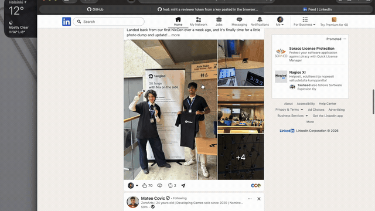
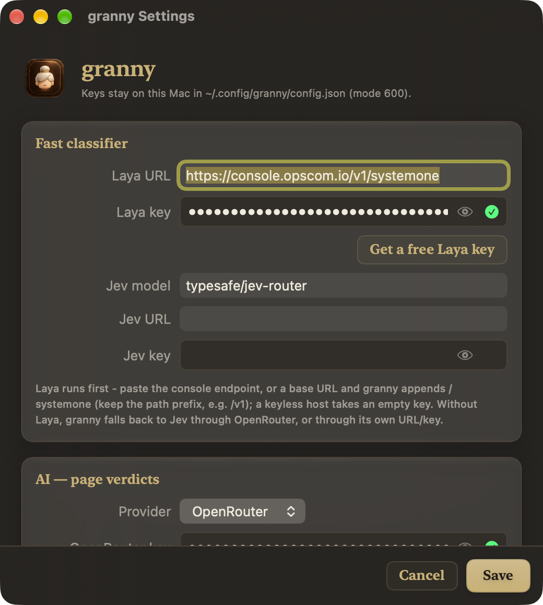

<p align="center">
  
</p>

<h1 align="center">granny</h1>

<p align="center">
  A strict macOS task enforcer. Work first, play after.<br>
  Free and open source.
</p>

<p align="center">
  <a href="https://github.com/HappyVoxel/granny/releases">Download</a> ·
  <a href="docs/INSTALL.md">Install guide</a> ·
  <a href="docs/ARCHITECTURE.md">Architecture</a> ·
  <a href="CONTRIBUTING.md">Contributing</a>
</p>

<p align="center">
  <a href="https://github.com/HappyVoxel/granny/releases/latest"></a>
  <a href="https://www.gnu.org/licenses/agpl-3.0"></a>
  
</p>

---

<p align="center">
  <a href=".github/assets/granny-demo.mp4">
    
  </a>
  <br>
  <sub><a href=".github/assets/granny-demo.mp4">▶ Watch the full 2-minute demo</a></sub>
</p>

## What it does

She asks what you are doing today, then watches: the entertainment dies while
the list is open - at the network layer for the known red flags, by content
for everything else - and the fun unlocks when the list is done. She keeps a
streak and is not impressed by your days off.

Context beats lists. A full YouTube video gets whistled at, Shorts get closed,
focus music plays on, and a task's allowed URLs are the real "look away" lever -
LinkedIn for a job application and LinkedIn for scrolling are not the same
site to her.

Native Swift end to end: a menubar app, a root helper that owns `/etc/hosts`,
and one MV3 extension for Safari and Chrome. The classifier is yours to host
(Laya/Jev); the LLM is bring-your-own-key.

<p align="center">
  
</p>

## Install

```bash
brew tap happyvoxel/tap
brew install --cask granny
```

Or grab the [dmg](https://github.com/HappyVoxel/granny/releases/latest/download/granny-macos.dmg).
The walkthrough - helper, browser extension, API keys - is
[docs/INSTALL.md](docs/INSTALL.md).

## Build

macOS 14+ and full Xcode (the app target needs the SwiftUI macro toolchain).

```bash
./scripts/install.sh            # build + app + helper + extensions
./scripts/install.sh --dry-run  # show what it would do
```

## Documentation

- [docs/INSTALL.md](docs/INSTALL.md) - Homebrew, helper, browsers, BYOK
- [docs/ARCHITECTURE.md](docs/ARCHITECTURE.md) - decision tiers, the day cycle

## Contributing

Read [CONTRIBUTING.md](CONTRIBUTING.md) first: setup, verification suites,
Conventional Commits, how to add a language or a decision rule.

## License

[GNU Affero General Public License v3.0](LICENSE).
