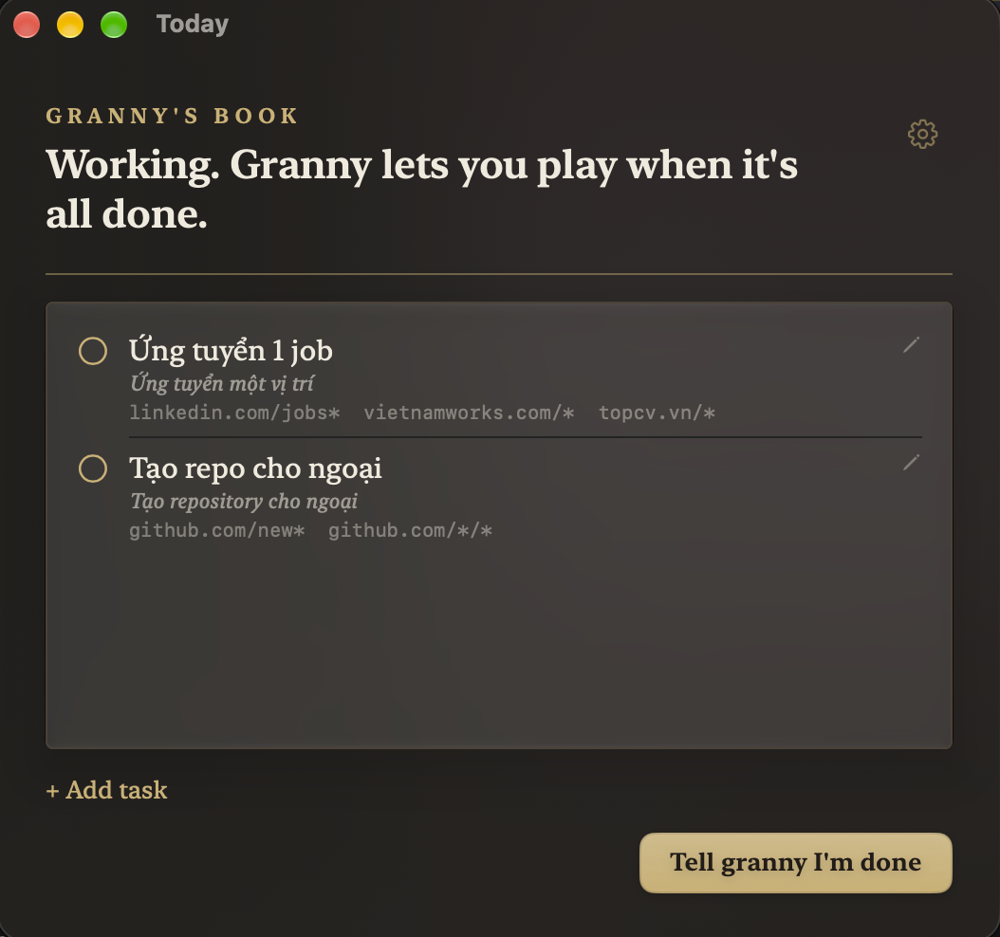

<p align="center">
  
</p>

<h1 align="center">granny</h1>

<p align="center">
  A strict macOS task enforcer. Work first, play after.<br>
  Free and open source.
</p>

<p align="center">
  <a href="https://github.com/HappyVoxel/granny/releases">Download</a> ·
  <a href="docs/ARCHITECTURE.md">Architecture</a> ·
  <a href="docs/INSTALL.md">Install guide</a> ·
  <a href="CONTRIBUTING.md">Contributing</a>
</p>

<p align="center">
  <a href="https://github.com/HappyVoxel/granny/releases/latest"></a>
  <a href="https://www.gnu.org/licenses/agpl-3.0"></a>
  
</p>

---

<p align="center">
  
</p>

## About

granny asks what you are doing today, blocks the entertainment while you work,
checks your claims, and unlocks the fun only when the list is done. She keeps a
ledger of your day offs and is not impressed by them.

She is also the eyes on the browser: every navigation goes through her. Rules
handle the known red flags in microseconds; a fast classifier (Laya, or Jev
when Laya is not configured) judges everything else; DeepSeek writes the
intake and takes over when the classifier is unsure. Facebook, Instagram,
TikTok, porn and game portals die at the network layer, YouTube Shorts die at
the URL layer, and a movie on YouTube gets whistled at while focus music plays
on.

Native Swift end to end: a menubar app, a small root helper that owns
`/etc/hosts`, and a browser extension. No Electron, no JavaScript runtime in
the enforcement path. AI is built in - bring your own keys.

## Why granny

Website blockers today fall into three groups:

- **Time-boxed blockers** (SelfControl and friends): strict, but blind. They
  have no idea what you are doing, only for how long you may not do it.
- **Hard lists**: no context. LinkedIn for a job application and LinkedIn for
  scrolling look identical to them.
- **AI-free managers**: can't tell focus music from a movie, a tutorial from a
  vlog.

granny is the missing fourth: **context-aware, content-aware, and honest about
its limits.** The machine owner can always bypass with sudo - granny makes it
loud, slow and annoying instead of pretending to be security.

## Platform

| Platform | Status |
|----------|--------|
| macOS 14+ | Stable |
| Windows | No |
| Linux | No |

## What's inside

- Morning intake: a bulleted notebook, parsed into tasks with allowed URL
  surfaces; vague tasks get a follow-up question
- Decision tiers: rules (microseconds) → Laya/Jev classifier → DeepSeek
  fallback, all content-aware and cached per URL
- Network enforcement: `/etc/hosts` block plus DoH and iCloud Private Relay
  ingress blocking, applied by a root helper with a NOPASSWD sudoers entry
- Browser extension (Safari + Chrome, one MV3 codebase): warn/block overlays,
  service-worker and cache purge on block, fail-closed when the daemon is down
- Safari tab janitor: closes blocked tabs (YouTube exempt except Shorts),
  purges their offline caches first
- App killer: entertainment apps are closed on launch and swept every 5 s
- Rewards: blocks lift when the list is done, return at bedtime, reset at
  wake; day off is one confirming question away
- Streak: a day banks when it ends with no frogs left behind; the flame
  shows from two clean days, a day off freezes it, unfinished frogs break it
- Langfuse tracing over OTLP: every classifier verdict and enforcement action
- Update check: once a day, and the menu's "Update available…" installs the
  release for you - a `brew upgrade` when Homebrew owns the copy, a
  checksum-verified in-place swap otherwise
- Settings watchlists: add or remove the apps granny closes, blocked sites
  and allowed sites right in Settings - no hand-editing the config file
- Each task's allowed URLs are editable from the task list (pencil icon),
  and any task can be dropped from the book (trash icon)
- BYOK settings: OpenRouter key, optional Laya/Jev classifier, optional
  Langfuse keys, language (English / Tiếng Việt / Suomi)

<p align="center">
  
</p>

## Install

granny is not yet on the App Store. Homebrew is the community-testing path:

```bash
brew tap happyvoxel/tap
brew install --cask granny
```

Or download from [GitHub Releases](https://github.com/HappyVoxel/granny/releases).
The full walkthrough - helper install, browser extension, API keys - is in
[docs/INSTALL.md](docs/INSTALL.md).

## How to build

Requirements: macOS 14 or later and full Xcode (the app target needs its
SwiftUI macro toolchain; CommandLineTools alone is not enough).

```bash
scripts/build-app.sh          # dist/granny.app
scripts/install-app.sh        # ~/Applications + login agent
sudo scripts/install-helper.sh
scripts/install-extension.sh  # detects browsers, installs the extension
```

`scripts/install.sh` runs all four in order. `--dry-run` shows what it would
do. Two consent toggles remain - Safari's extension checkbox and Chrome's
Load unpacked - because Apple and Google require a human; the installer opens
the exact panes.

## Documentation

- [docs/ARCHITECTURE.md](docs/ARCHITECTURE.md) - components, decision tiers,
  the day cycle, the decision log
- [docs/INSTALL.md](docs/INSTALL.md) - Homebrew, helper, browsers, BYOK

## Contributing

Contributions are welcome - read [CONTRIBUTING.md](CONTRIBUTING.md) before
opening a PR. It covers the setup, the verification suites (unit tests plus
the e2e shell suites), code style, Conventional Commits, branch naming, and
how to add a language or a decision rule.

## License

This project is licensed under the
[GNU Affero General Public License v3.0 (AGPLv3)](LICENSE).
